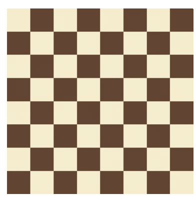

# Solve N-Queens with Constraint Satisfaction  

 

Constraint satisfaction problems (CSPs) are mathematical problems defined as a set of objects whose state must satisfy a number of constraints or limitations. A common example of CSPs is the N-Queens problem, in which we are asked to place N queens on a standard NxN chessboard such that none of the queens are in "check" (i.e., no two queens occupy the same row, column, or diagonal). 

In this project, an 8-queens solver is implemented by first explicitly constructing binary constraints for the problem with symbolic math library [`SymPy`](http://www.sympy.org/en/index.html), and then writing search functions for recursive backtracking to find the solution. 

(Note: Examples of using symbols - `sympy.Symbol`, functions - `sympy.Function`, and expressions - `sympy.Expr` from `SymPy` can be found in `Sympy_Intro.ipynb`.) 

